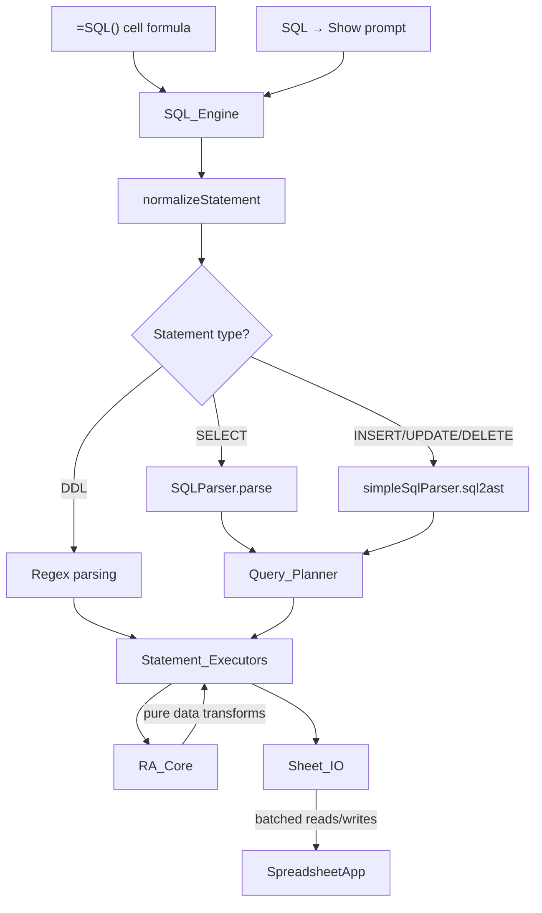

# Design Document: SQL Engine Rebuild

## Overview

This design describes the rebuild of the SheetSQL Google Sheets add-on SQL engine from a monolithic, copy-paste-heavy architecture into a clean, layered system. The current codebase suffers from:

- **Duplicated logic**: WHERE evaluation, set operations (`sIntersect`/`sUnion` vs `intersectSortedRows_`/`unionSortedRows_`), and row selection are copy-pasted across `Select.gs`, `Delete.gs`, `Update.gs`, and `Where.gs`.
- **Loose equality**: `==` used throughout `RA.gs` and statement executors instead of `===`.
- **Cell-by-cell I/O**: `Update.gs` calls `setValue` per cell; `Insert.gs` calls `appendRow`; `Delete.gs` calls `deleteRow` in a loop.
- **Tight coupling**: Every executor directly calls `SpreadsheetApp` APIs, making the relational algebra logic untestable without mocking the entire Sheets API.
- **Inconsistent errors**: Some code throws raw strings (`throw "Invalid sheet : " + name`), others throw `Error` objects.

The rebuild introduces four layers:

1. **Sheet_IO** — the only layer that touches `SpreadsheetApp`. Provides batched read/write primitives.
2. **RA_Core** — pure functions for relational algebra (select, project, join, union, intersection, difference, sort, distinct, groupBy, aggregates). Zero side effects, fully testable.
3. **Query_Planner** — translates parsed ASTs into ordered sequences of RA_Core operations.
4. **Statement_Executors** — thin dispatchers that wire the planner output to Sheet_IO.

The vendored parsers (`SQLParser.gs`, `SimpleSQL.gs`) remain untouched. The `SQL()` custom function, menu UI, and result format stay backward-compatible.

## Architecture



### Layer Responsibilities

| Layer | Files | Touches SpreadsheetApp? | Testable without mocks? |
|-------|-------|------------------------|------------------------|
| Sheet_IO | `SheetIO.gs` | Yes | No (needs Sheets mocks) |
| RA_Core | `RA.gs` (rewritten) | No | Yes |
| Query_Planner | `QueryPlanner.gs` (new) | No | Yes |
| Statement_Executors | `Select.gs`, `Insert.gs`, `Update.gs`, `Delete.gs`, `Table.gs` (rewritten) | No (delegates to Sheet_IO) | Yes (with Sheet_IO mock) |
| SQL_Engine | `SQL.gs` (updated) | Indirectly via Sheet_IO | Yes (top-level dispatch) |

### Data Flow: SELECT Example

1. `SQL("SELECT name FROM employees WHERE age > 30 ORDER BY name ASC LIMIT 10")`
2. `SQL.gs` normalizes, identifies SELECT, calls `SQLParser.parse()`
3. Query_Planner receives AST, produces plan: `[readTable("employees"), select("age", ">", 30), project(["name"]), sort(["name"], ["ASC"]), limit(10)]`
4. Statement_Executor walks the plan:
   - Calls `Sheet_IO.readTable("employees")` → Table_Array
   - Calls `RA_Core.select(table, "age", ">", 30)` → filtered Table_Array
   - Calls `RA_Core.project(table, ["name"])` → projected Table_Array
   - Calls `RA_Core.sort(table, ["name"], ["ASC"])` → sorted Table_Array
   - Applies limit → sliced Table_Array
5. Returns result to `SQL.gs` which formats the output rows

### Data Flow: UPDATE Example

1. `SQL("UPDATE employees SET salary=50000 WHERE dept='Engineering'")`
2. `SQL.gs` normalizes, identifies UPDATE, calls `simpleSqlParser.sql2ast()`
3. Query_Planner receives AST, produces plan: `{table: "employees", where: {attr: "dept", op: "=", val: "Engineering"}, set: [{col: "salary", val: 50000}]}`
4. Statement_Executor:
   - Calls `Sheet_IO.readTable("employees")` → Table_Array
   - Calls `RA_Core.select(table, "dept", "=", "Engineering")` → matching row indices
   - Calls `Sheet_IO.updateCells("employees", rowIndices, colUpdates)` → batched write

## Components and Interfaces

### Sheet_IO (`SheetIO.gs`)

The I/O isolation layer. All SpreadsheetApp access goes through here.

```javascript
/**
 * Read an entire sheet as a Table_Array.
 * Row 0 = [tableName], Row 1 = column headers, Row 2+ = data.
 * @param {string} sheetName
 * @returns {Array<Array>} Table_Array
 * @throws {Error} "Invalid sheet : {name}" if sheet doesn't exist
 * @throws {Error} "Sheet should atleast have a header" if sheet is empty
 */
function sheetIO_readTable(sheetName) { }

/**
 * Read the currently selected range as a Table_Array.
 * Row 0 = ["RANGE"], Row 1 = first row (treated as headers), Row 2+ = data.
 * @returns {Array<Array>} Table_Array
 */
function sheetIO_readRange() { }

/**
 * Write a 2D array to a target sheet using a single setValues call.
 * @param {string} sheetName
 * @param {Array<Array>} rows - 2D array of values
 */
function sheetIO_writeRows(sheetName, rows) { }

/**
 * Delete specified row indices from a sheet.
 * Deletes in descending order to preserve correct indices.
 * @param {string} sheetName
 * @param {Array<number>} rowIndices - 1-based sheet row indices, sorted ascending
 */
function sheetIO_deleteRows(sheetName, rowIndices) { }

/**
 * Write changed cell values using batched setValues.
 * @param {string} sheetName
 * @param {Array<{row: number, col: number, value: *}>} updates - 1-based row/col positions
 */
function sheetIO_updateCells(sheetName, updates) { }

/**
 * Create a new sheet with optional bold column headers.
 * @param {string} sheetName
 * @param {Array<string>} [columns] - optional header names
 * @throws {Error} "Table already exists: {name}" if sheet exists
 */
function sheetIO_createSheet(sheetName, columns) { }

/**
 * Delete a sheet by name.
 * @param {string} sheetName
 * @throws {Error} "Invalid sheet : {name}" if sheet doesn't exist
 */
function sheetIO_deleteSheet(sheetName) { }

/**
 * Add a column to a sheet's header row.
 * @param {string} sheetName
 * @param {string} columnName
 * @throws {Error} if column already exists
 */
function sheetIO_addColumn(sheetName, columnName) { }

/**
 * Remove a column from a sheet.
 * @param {string} sheetName
 * @param {string} columnName
 * @throws {Error} if column doesn't exist
 */
function sheetIO_dropColumn(sheetName, columnName) { }

/**
 * Get or create the SQL history sheet.
 * @returns {Sheet}
 */
function sheetIO_getOrCreateSqlSheet() { }

/**
 * Append output rows to the SQL history sheet using batched setValues.
 * @param {Sheet} sheet
 * @param {Array<Array>} rows
 */
function sheetIO_appendOutputRows(sheet, rows) { }
```

### RA_Core (`RA.gs` — rewritten)

Pure relational algebra functions. No SpreadsheetApp references. All comparisons use `===` unless operator semantics require coercion (e.g., `<`, `>` on mixed types).

```javascript
/**
 * Find element index in array using strict equality.
 * @param {Array} arr
 * @param {*} element
 * @returns {number} index or -1
 */
function findInArray_(arr, element) { }

/**
 * Filter rows matching a condition.
 * @param {Array<Array>} tableArray - Table_Array format
 * @param {string} attribute - column name
 * @param {string} operator - one of <, >, =, >=, <=, LIKE, IN, IS, IS NOT
 * @param {*} value - comparison value (or array for IN)
 * @returns {Array<Array>} filtered Table_Array (for SELECT) 
 */
function raSelect(tableArray, attribute, operator, value) { }

/**
 * Filter rows and return matching row indices (0-based into tableArray).
 * Used by UPDATE/DELETE to identify which rows to modify/remove.
 * @param {Array<Array>} tableArray
 * @param {string} attribute
 * @param {string} operator
 * @param {*} value
 * @returns {Array<number>} matching row indices (indices into tableArray, starting from 2)
 */
function raSelectIndices(tableArray, attribute, operator, value) { }

/**
 * Extract specified columns from a Table_Array.
 * @param {Array<Array>} tableArray
 * @param {Array<string|object>} attributes - column names or expression objects
 * @returns {Array<Array>} projected Table_Array
 */
function raProject(tableArray, attributes) { }

/**
 * Join two Table_Arrays.
 * @param {Array<Array>} left
 * @param {Array<Array>} right
 * @param {Array<Array<string>>} keys - [[leftCol, rightCol], ...]
 * @param {Array<string>} operators - comparison operators per key pair
 * @param {string} joinType - "inner", "left", or "right"
 * @returns {Array<Array>} joined Table_Array
 */
function raJoin(left, right, keys, operators, joinType) { }

/**
 * Combine two Table_Arrays (all rows from both).
 * @param {Array<Array>} table1
 * @param {Array<Array>} table2
 * @returns {Array<Array>} combined Table_Array
 * @throws {Error} if column counts don't match
 */
function raUnion(table1, table2) { }

/**
 * Rows present in both Table_Arrays.
 * @param {Array<Array>} table1
 * @param {Array<Array>} table2
 * @returns {Array<Array>} intersection Table_Array
 */
function raIntersection(table1, table2) { }

/**
 * Rows in table1 not in table2.
 * @param {Array<Array>} table1
 * @param {Array<Array>} table2
 * @returns {Array<Array>} difference Table_Array
 */
function raDifference(table1, table2) { }

/**
 * Sort rows by one or more columns.
 * @param {Array<Array>} tableArray
 * @param {Array<string>} columns
 * @param {Array<string>} directions - "ASC" or "DESC" per column
 * @returns {Array<Array>} sorted Table_Array
 */
function raSort(tableArray, columns, directions) { }

/**
 * Remove duplicate rows.
 * @param {Array<Array>} tableArray
 * @returns {Array<Array>} deduplicated Table_Array
 */
function raDistinct(tableArray) { }

/**
 * Remove duplicates based on a single column.
 * @param {Array<Array>} tableArray
 * @param {string} column
 * @returns {Array<Array>} deduplicated Table_Array
 */
function raDistinctOn(tableArray, column) { }

/**
 * Group rows and apply aggregate functions.
 * @param {Array<Array>} tableArray
 * @param {Array<string>} groupColumns
 * @param {Array<{func: string, column: string}>} aggregates - e.g., [{func: "SUM", column: "salary"}]
 * @returns {Array<Array>} grouped Table_Array with aggregate columns
 */
function raGroupBy(tableArray, groupColumns, aggregates) { }

/**
 * Evaluate compound WHERE conditions (AND/OR trees).
 * Recursively combines row index sets using set intersection (AND) or union (OR).
 * @param {Array<Array>} tableArray
 * @param {object} conditions - AST condition tree
 * @returns {Array<number>} matching row indices
 */
function raResolveWhere(tableArray, conditions) { }

/**
 * Intersect two sorted arrays of row indices.
 * @param {Array<number>} rows0
 * @param {Array<number>} rows1
 * @returns {Array<number>}
 */
function raIntersectRows(rows0, rows1) { }

/**
 * Union two sorted arrays of row indices.
 * @param {Array<number>} rows0
 * @param {Array<number>} rows1
 * @returns {Array<number>}
 */
function raUnionRows(rows0, rows1) { }

/**
 * Compute aggregate value for a data set.
 * @param {Array<Array>} data - data rows (no headers)
 * @param {number} columnIndex
 * @param {string} func - SUM, COUNT, MIN, MAX, AVG
 * @returns {number}
 */
function raAggregate(data, columnIndex, func) { }

/**
 * Evaluate LIKE pattern matching.
 * % matches zero or more characters, _ matches exactly one character.
 * @param {string} value
 * @param {string} pattern
 * @returns {boolean}
 */
function raLike(value, pattern) { }
```

### Query_Planner (`QueryPlanner.gs` — new)

Translates parsed ASTs into execution plans. Does not execute anything itself.

```javascript
/**
 * Plan a SELECT query from a SQLParser AST.
 * Returns an ordered plan: source, joins, where, groupBy, having, project, distinct, unions, orderBy, limit.
 * @param {object} ast - SQLParser.parse() output
 * @returns {object} execution plan
 */
function planSelect(ast) { }

/**
 * Plan an UPDATE from a simpleSqlParser AST.
 * Returns: {table, where, setAssignments}.
 * @param {object} ast - simpleSqlParser.sql2ast() output
 * @returns {object} execution plan
 */
function planUpdate(ast) { }

/**
 * Plan a DELETE from a simpleSqlParser AST.
 * Returns: {table, where}.
 * @param {object} ast - simpleSqlParser.sql2ast() output
 * @returns {object} execution plan
 */
function planDelete(ast) { }

/**
 * Plan an INSERT from a simpleSqlParser AST.
 * Returns: {table, columns, values}.
 * @param {object} ast - simpleSqlParser.sql2ast() output
 * @returns {object} execution plan
 */
function planInsert(ast) { }
```

### Statement Executors (rewritten)

Each executor becomes a thin function that:
1. Parses the SQL string using the appropriate parser
2. Passes the AST to the Query_Planner
3. Executes the plan by calling RA_Core and Sheet_IO

```javascript
// Select.gs
function selectQuery(input) { }

// Insert.gs  
function insert(input) { }

// Update.gs
function update(input) { }

// Delete.gs
function deleteFrom(input) { }

// Table.gs (DDL — these don't need the planner, they use regex + Sheet_IO directly)
function createTable(input) { }
function dropTable(input) { }
function alterTable(input) { }
```

### SQL_Engine (`SQL.gs` — updated)

The top-level entry point remains largely the same. Key changes:
- Error handling uses `err.message` for Error objects, `String(err)` for legacy string throws
- Output writing delegates to `Sheet_IO` instead of direct SpreadsheetApp calls

### Error_Reporter

Error handling is integrated into `SQL.gs` rather than a separate module, keeping the architecture simple:

```javascript
/**
 * Format an error for user display.
 * Handles both Error objects (err.message) and legacy string throws (String(err)).
 * @param {*} err
 * @returns {string}
 */
function formatError_(err) {
  if (err instanceof Error) {
    return err.message;
  }
  return String(err);
}
```

All internal code throws `Error` objects with descriptive messages. The vendored parsers may throw strings, which `formatError_` handles.

## Data Models

### Table_Array Format

The internal representation for all table data. This format is preserved from the current implementation for backward compatibility.

```
Index 0: [tableName]           — single-element array with the table/sheet name
Index 1: [col1, col2, col3]   — column header names
Index 2: [val1, val2, val3]   — first data row
Index 3: [val4, val5, val6]   — second data row
...
```

Example:
```javascript
[
  ["employees"],                          // row 0: table name
  ["id", "name", "dept", "salary"],       // row 1: headers
  [1, "Alice", "Engineering", 80000],     // row 2: data
  [2, "Bob", "Sales", 60000],             // row 3: data
  [3, "Carol", "Engineering", 90000]      // row 4: data
]
```

### Execution Plan (SELECT)

```javascript
{
  source: "employees" | "RANGE",
  joins: [
    { table: "departments", keys: [["dept_id", "id"]], operators: ["="], side: "left" | "right" | null }
  ],
  where: { /* AST condition tree — passed directly to raResolveWhere */ },
  groupBy: { columns: ["dept"], having: { /* condition */ } },
  fields: [ /* field descriptors from AST */ ],
  distinct: true | false,
  unions: [ /* sub-select ASTs */ ],
  orderBy: { columns: ["name"], directions: ["ASC"] },
  limit: 10 | null
}
```

### Execution Plan (UPDATE)

```javascript
{
  table: "employees",
  where: { /* AST condition tree */ },
  setAssignments: [{ column: "salary", value: 50000 }]
}
```

### Execution Plan (DELETE)

```javascript
{
  table: "employees",
  where: { /* AST condition tree */ }
}
```

### Execution Plan (INSERT)

```javascript
{
  table: "employees",
  columns: ["name", "dept"] | null,   // null = positional insert
  values: ["Dave", "Marketing"]
}
```

### AST Formats (read-only, from vendored parsers)

**SQLParser** (for SELECT): Produces an object with `source`, `fields`, `joins`, `where`, `group`, `order`, `limit`, `unions`, `distinct` keys. Field values use `{value: "name"}` wrappers.

**simpleSqlParser** (for INSERT/UPDATE/DELETE): Produces an object keyed by SQL clause (`"INSERT INTO"`, `"VALUES"`, `"UPDATE"`, `"SET"`, `"WHERE"`, `"DELETE FROM"`). WHERE conditions use `{logic, terms}` or `{left, operator, right}` structure.


## Correctness Properties

*A property is a characteristic or behavior that should hold true across all valid executions of a system — essentially, a formal statement about what the system should do. Properties serve as the bridge between human-readable specifications and machine-verifiable correctness guarantees.*

### Property 1: Select filters correctly

*For any* valid Table_Array and any supported comparison operator (`<`, `>`, `=`, `>=`, `<=`, `IN`), applying `raSelect` with an attribute, operator, and value SHALL return a Table_Array where every data row satisfies the condition and no row satisfying the condition is omitted.

**Validates: Requirements 1.1, 1.10, 6.1, 6.3**

### Property 2: Project preserves rows and extracts columns

*For any* valid Table_Array and any valid subset of its column names, applying `raProject` SHALL return a Table_Array with the same number of data rows where each row contains only the values from the specified columns in the correct order.

**Validates: Requirements 1.2**

### Property 3: Join key invariant

*For any* two valid Table_Arrays with at least one overlapping key value, applying `raJoin` with join type "inner" SHALL return a Table_Array where every output row has matching key values from both input tables. For "left" join, every row from the left table SHALL appear at least once in the output. For "right" join, every row from the right table SHALL appear at least once in the output.

**Validates: Requirements 1.3, 7.4**

### Property 4: Set operations correctness

*For any* two valid Table_Arrays with the same column count: (a) `raUnion` SHALL return a Table_Array containing all data rows from both inputs; (b) `raIntersection` SHALL return only rows present in both inputs; (c) `raDifference` SHALL return only rows present in the first input but not the second.

**Validates: Requirements 1.4, 7.5**

### Property 5: Sort produces ordered permutation

*For any* valid Table_Array and any valid sort specification (columns + ASC/DESC directions), applying `raSort` SHALL return a Table_Array whose data rows are a permutation of the input data rows and where adjacent rows satisfy the specified ordering constraint.

**Validates: Requirements 1.5, 7.8**

### Property 6: Distinct eliminates duplicates

*For any* valid Table_Array, applying `raDistinct` SHALL return a Table_Array where no two data rows are identical and every unique row from the input appears exactly once. Applying `raDistinctOn` with a column name SHALL return a Table_Array where no two data rows share the same value in that column.

**Validates: Requirements 1.6, 7.3**

### Property 7: GroupBy aggregate correctness

*For any* valid Table_Array with numeric data and any grouping column, applying `raGroupBy` with aggregate functions SHALL produce correct aggregate values: COUNT equals the number of rows in each group, SUM equals the sum of values, MIN/MAX equal the minimum/maximum, and AVG equals SUM/COUNT.

**Validates: Requirements 1.7, 7.2, 7.6**

### Property 8: Compound WHERE combines conditions correctly

*For any* valid Table_Array and any two filter conditions, evaluating them with AND SHALL return the intersection of individually matching row sets, and evaluating them with OR SHALL return the union of individually matching row sets.

**Validates: Requirements 1.8**

### Property 9: LIKE pattern matching

*For any* string value and any LIKE pattern, `raLike` SHALL return true if and only if the value matches the pattern where `%` matches zero or more characters and `_` matches exactly one character.

**Validates: Requirements 6.2**

### Property 10: Column-to-column comparison

*For any* valid Table_Array with at least two columns and any comparison operator, column-to-column select SHALL return exactly those rows where the cell value in the first column satisfies the operator against the cell value in the second column.

**Validates: Requirements 6.6**

### Property 11: Arithmetic projection computes correctly

*For any* valid Table_Array with a numeric column and any arithmetic operator (`+`, `-`, `/`) with a numeric operand, projecting with that arithmetic expression SHALL produce a new column where each cell equals the original value combined with the operand using the specified operator.

**Validates: Requirements 7.1**

### Property 12: HAVING filters groups correctly

*For any* grouped Table_Array and any HAVING condition with an aggregate function and comparison, only groups where the aggregate value satisfies the comparison SHALL remain in the output.

**Validates: Requirements 7.7**

### Property 13: LIMIT restricts row count

*For any* valid Table_Array with N data rows and any limit value L, applying limit SHALL return at most L data rows (plus the header rows).

**Validates: Requirements 7.9**

### Property 14: INSERT column mapping fills correctly

*For any* set of table columns, any subset of those columns specified in an INSERT, and corresponding values, the resulting row SHALL have the provided values at the correct column positions and blank strings at all unspecified positions.

**Validates: Requirements 8.8**

### Property 15: DML parse round-trip

*For any* valid INSERT, UPDATE (with WHERE), or DELETE (with WHERE) statement, parsing with `simpleSqlParser.sql2ast` then unparsing with `simpleSqlParser.ast2sql` SHALL produce a semantically equivalent SQL string.

**Validates: Requirements 12.1, 12.2, 12.3**

## Error Handling

### Error Strategy

All internal code throws `Error` objects with descriptive messages. The vendored parsers (`SQLParser.gs`, `SimpleSQL.gs`) may throw raw strings, which are handled at the top level.

### Error Categories

| Category | Source | Handling |
|----------|--------|----------|
| Parse errors | Vendored parsers throw strings or Errors | Caught in `executeStatement`, formatted via `formatError_` |
| Sheet not found | `Sheet_IO.readTable` | Throws `Error("Invalid sheet : " + name)` |
| Empty sheet | `Sheet_IO.readTable` | Throws `Error("Sheet should atleast have a header")` |
| Invalid attribute | `RA_Core` functions | Throws `Error("Invalid attribute : " + name)` |
| Invalid operator | `RA_Core.raSelect` | Throws `Error("Invalid operator : " + op)` |
| Column count mismatch | `RA_Core` set operations, `Insert` | Throws `Error` with descriptive message |
| Table already exists | `Sheet_IO.createSheet` | Throws `Error("Table already exists: " + name)` |
| Empty/null statement | `SQL.gs` | Returns `[["Syntax invalid: empty statement"]]` |
| Statement too long | `SQL.gs` | Returns `[["Syntax invalid: statement exceeds max length"]]` |
| Unrecognized statement | `SQL.gs` | Returns `[["Syntax invalid"]]` |

### Error Formatting

```javascript
function formatError_(err) {
  if (err instanceof Error) {
    return err.message;
  }
  return String(err);
}
```

The top-level `executeStatement` function wraps all errors:

```javascript
function executeStatement(statement, handler) {
  try {
    var output = [[statement + SQL_SUCCESS_SUFFIX]];
    var result = handler.execute(statement);
    if (handler.withSelectResult) {
      output = output.concat(result || []);
    }
    return output;
  } catch (err) {
    return [['Query failed: ' + formatError_(err)]];
  }
}
```

### Migration from String Throws

All existing `throw "string"` patterns in non-vendored code are converted to `throw new Error("string")`. The error messages are preserved exactly (including the space before the colon in `"Invalid sheet : "`) for backward compatibility.

## Testing Strategy

### Testing Framework

- **Test runner**: Node.js with the built-in `assert` module (matching the existing `tests/sql.test.js` pattern)
- **Property-based testing**: `fast-check` library for generating random inputs
- **Execution**: `node tests/sql.test.js` for unit/example tests, `node tests/ra.property.test.js` for property tests

### Test Categories

#### 1. Property-Based Tests (RA_Core)

Each correctness property from the design maps to a `fast-check` property test with a minimum of 100 iterations. The RA_Core functions are pure and operate on in-memory arrays, making them ideal for PBT.

**Test file**: `tests/ra.property.test.js`

Tests cover:
- Select filtering (Property 1)
- Project column extraction (Property 2)
- Join key invariant (Property 3)
- Set operations (Property 4)
- Sort ordering (Property 5)
- Distinct deduplication (Property 6)
- GroupBy aggregates (Property 7)
- Compound WHERE (Property 8)
- LIKE matching (Property 9)
- Column-to-column comparison (Property 10)
- Arithmetic projection (Property 11)
- HAVING filtering (Property 12)
- LIMIT row count (Property 13)
- INSERT column mapping (Property 14)

Each test is tagged: `Feature: sql-engine-rebuild, Property {N}: {title}`

Configuration: minimum 100 iterations per property (`fc.assert(property, { numRuns: 100 })`).

**Test file**: `tests/parser.property.test.js`

- DML parse round-trip (Property 15)

#### 2. Example-Based Unit Tests

**Test file**: `tests/sql.test.js` (extended)

Cover:
- Statement normalization (empty, whitespace, semicolons)
- Statement handler dispatch
- Row normalization for output
- Max query length enforcement
- Success/error message format
- Strict equality behavior (0 vs "", null vs undefined)
- Column aliasing
- IS NULL / IS NOT NULL matching
- Backward compatibility: existing SQL syntax produces same results

#### 3. Integration Tests (with SpreadsheetApp mocks)

**Test file**: `tests/integration.test.js`

Cover:
- Sheet_IO functions with mocked SpreadsheetApp
- Statement executors delegating to Sheet_IO correctly
- Batched I/O verification (setValues called, not setValue/appendRow)
- DDL operations (CREATE/DROP/ALTER TABLE)
- UI menu registration and prompt flow

#### 4. Smoke Tests

- `onOpen` registers menu correctly
- `onInstall` calls `onOpen`
- `appsscript.json` contains only required scopes

### Test Generators (for PBT)

Custom `fast-check` arbitraries for generating test data:

```javascript
// Generate a valid Table_Array with random data
const tableArrayArb = (minRows, maxRows, minCols, maxCols) =>
  fc.tuple(
    fc.string(),                                    // table name
    fc.array(fc.string(), {minLength: minCols, maxLength: maxCols}),  // headers
    fc.array(                                       // data rows
      fc.array(fc.oneof(fc.integer(), fc.string()), {minLength: minCols, maxLength: maxCols}),
      {minLength: minRows, maxLength: maxRows}
    )
  ).map(([name, headers, rows]) => {
    // Normalize column count
    const colCount = headers.length;
    const normalizedRows = rows.map(r => {
      const row = r.slice(0, colCount);
      while (row.length < colCount) row.push('');
      return row;
    });
    return [[name], headers, ...normalizedRows];
  });

// Generate a valid LIKE pattern
const likePatternArb = fc.stringOf(
  fc.oneof(fc.char(), fc.constant('%'), fc.constant('_'))
);
```

### Running Tests

```bash
# Unit and example tests
npm test

# Property tests (requires fast-check)
node tests/ra.property.test.js
node tests/parser.property.test.js
```

### Coverage Goals

- RA_Core: 100% function coverage via property tests
- Sheet_IO: 100% function coverage via integration tests with mocks
- Query_Planner: Key paths covered via example-based tests
- Statement Executors: Delegation verified via integration tests
- SQL_Engine: Entry points covered via existing + extended unit tests
